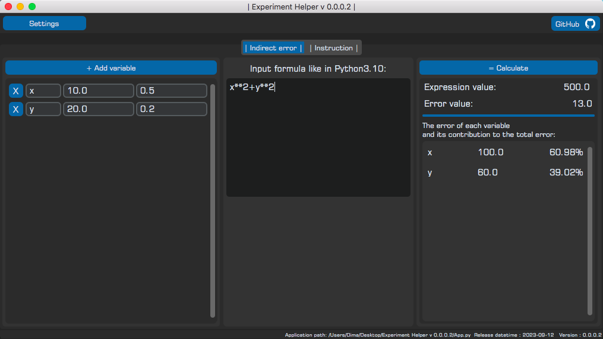

 

  

  <h3 align="center">Experiment-Helper</h3>

  

    Application, which will avoid you to calculate indirect errors faster
     
     
  

 

## About The Project

This repository contains a code of an open-source project, the main idea if which is to help young scientists in calculating indirect errors, plotting linear and other dependencies and etc.

## Usage

Application was made to help other students to make laboratory works faster.
It can be useful tool in preprocessing data in science researches.

## Authors

* **Dmitry** - *MSU Physical Faculty student* - [Dmitry](https://github.com/RenRaw-Pr)
